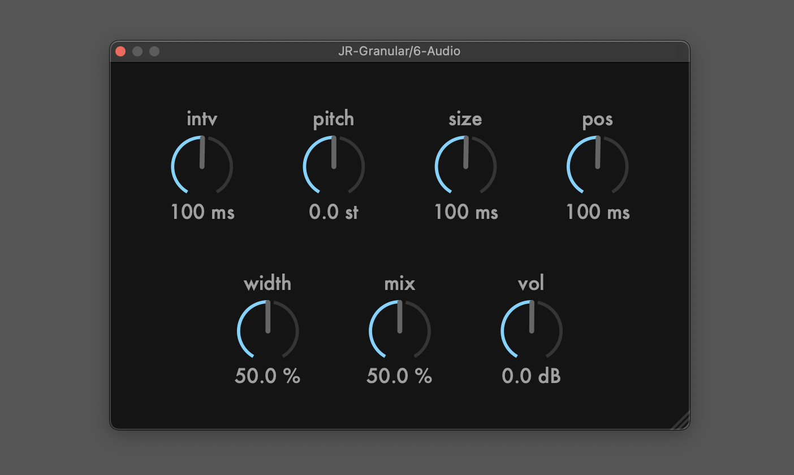

# JR-Granular
This is a real-time granular fx plugin made with JUCE and RNBO C++ export. 



This project is an example of using APVTS (juce::AudioProcessorValueTreeState) to link the exported code with custom JUCE UIs, 
so I will not add any new features to this plugin.

## Building

```
$ git clone https://github.com/szkkng/jr-granular.git --recursive
$ cd jr-granular
$ cmake -S . -B build -DCMAKE_BUILD_TYPE=Release
$ cmake --build build --config Release
```

## UI Manual
- value changes: dragging or arrow keys
- fine mode: shift + dragging or shift + arrow keys
- edit mode: 0-9
- undo: [mac] cmd + z, [win] ctrl + z
- redo: [mac] cmd + shift + z, [win] ctrl + shift + z
- reset: double click

## Links
- Demo: [JR-Granular - JUCE & RNBO C++ Export](https://twitter.com/kng_dev/status/1587611842272055297?s=20&t=urpfRicQtbKBhkqoNniYBw)
- Tutorial: [JR-Granular - JUCE & RNBO C++ Export](https://kengo.dev/posts/jr-granular)

## References
- [Programming a Custom UI with JUCE](https://rnbo.cycling74.com/learn/programming-a-custom-ui-with-juce)
- [RNBO C++ API Reference](https://rnbo.cycling74.com/cpp)
- [Cycling74/gen-plugin-export](https://github.com/Cycling74/gen-plugin-export)

